```
<font size="-1" style="color:#777799"></font>
```

# 1. Attention by Biased Competition

## Cocktail Party Effect

The phenomenon in which multiple conversations and other sounds are occurring simultaneously, yet a listener can selectively focus on one voice or conversation and effectively tune out the others.

| Cocktail Party Experiment --- _Colin Cherry (1953)_          |      |
| :----------------------------------------------------------- | ---- |
| **Method:** 2 different messages are presented to the left and right ear respectively. The subject has to attend the message in a specific ear and repeat it immediately (i.e. shadowing). The content of the unattended message is also asked.<br /><br />**Result:** Subjects could accurately report the content of the attended message, but struggled with the unattended message (i.e. performance is better after a valid cue). Though most subjects accurately reported the gender of the speaker of the unattended message. Subjects also struggled with attending 2 streams simultaneously.<br /><br />**Conclusion:** 1.) Even if multiple pass through the ears, cochlea and nervous system, we can focus on one and block out the others by means of our conscious attention. <br />2.) The cue that instructs us what stream we have to attend to is kept "alive" in neuronal circuits long before the actual stimulus appears. <br />3.) The attended stream enters conscious awareness and can later be remembered. |      |

Later experiments showed that attention was given to the unattended message when it mentioned the subject's name. This indicates that some info in the unattended message makes it to the semantic level. <br>Fun fact: impairment of selective attention is one of the major symptoms in pathological states such as schizophrenia and ADHD.


## Attention

Attention is a broad term, so a clear distinction between it and other terms must be made. Most notably arousal.

**Attention & Arousal**:

- Arousal describes the global state of the brain. The broadest categorization is the spectrum between being awake or asleep.
- When asleep, people are very unattentive. But when awake, people can have varying levels of attentiveness.
- Research shows that people have slower reactions and reduced performance in cognitive tasks when drowsy.
- Most often, **attention is selectively focused**. Meaning that processing resources are allocated to certain stimuli, while neglecting other stimuli.
- Lecturer: *"Selective attention assumes a minimum level of arousal, on top of which there is selection that is driven by a certain dimension (e.g. spatial, auditory, etc.)"*


|                           | Studying Visual Spatial Attention --- _Hermann von Helmholtz_ |
| ------------------------- | ------------------------------------------------------------ |
|  | **Method:** Example of the cocktail party effect. Subjects were briefly presented with an array of letters and asked to recall them afterwards. Subjects also had to attend a certain portion of the array without shifting their gaze.<br /><br />**Result:** The items in the attended portion could be accurately reported, but not the other ones.<br /><br />**Interpretation:** People are able to attend a certain portion of the visual field without shifting their gaze towards it (i.e. covert/peripheral attention). As opposed to when the gaze is directed towards a stimulus (i.e. overt attention). |


## Attention Selection Models

**Early selection** states that irrelevant information is filtered out before it is analyzed.

**Late selection** states that information is first processed before selection occurs.

|                           | Early Selection Model --- _Broadbent_                        |
| ------------------------- | ------------------------------------------------------------ |
| 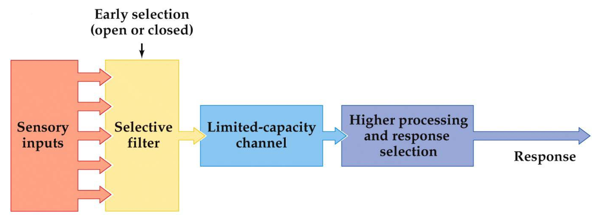 | All-or-nothing model. Incoherent with the fact that highly relevant information (such as your name) in an unattended stream still enters consciousness. |

|                           | Early Selection Based Attenuation Model --- _Treisman_       |
| ------------------------- | ------------------------------------------------------------ |
| 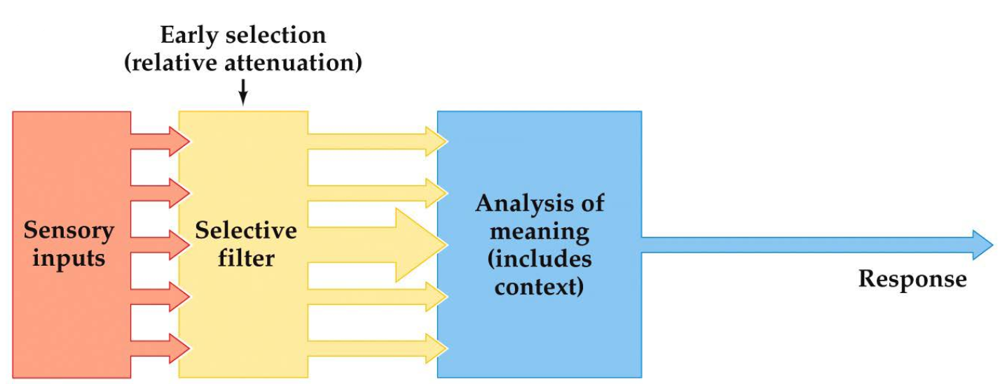 | Some unattended semantic information makes it to the analysis stage. Though only information that stands out (like your own name) passes through the first filter. |

|                           | Early, Middle and Late Top-Down Selection                    |
| ------------------------- | ------------------------------------------------------------ |
| 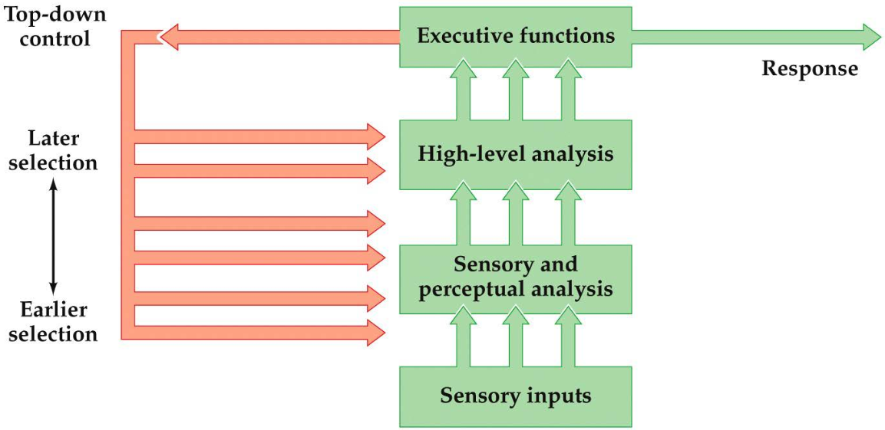 | Allows for early selection based on physical characteristics, but also late selection when semantic processing is needed for selection. It uses top-down control for this approach. |


## Endogenous vs. Exogenous Attention

**Endogenous attention** applies to situations where a subject voluntarily directs their attention towards stimulus, usually by interpreting a cue (such as an arrow). If the cue provides no information (i.e. a neutral cue), there is no change in behaviour.

|                          |                                                             |
| ------------------------- | ------------------------------------------------------------ |
| 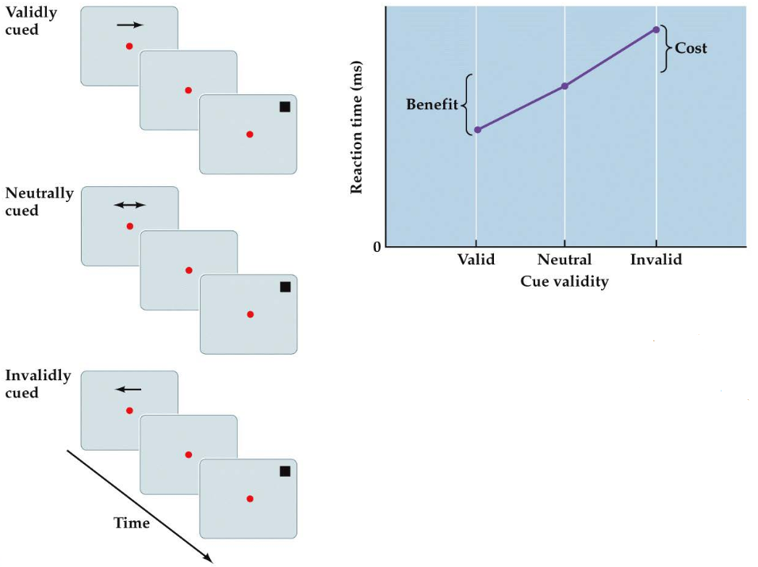 | **Method:** The subject's gaze is fixed on a central point. They're presented with a valid, invalid or neutral, position related cue. <br />The subject has to indicate that the target appeared when it does, regardless of the cue. <br /><br />**Result:** Subjects are faster to respond to validly cued targets than invalidly queued ones, with the response time of neutrally cued targets <br />being in the middle. The effect of the queue lasts from 300 milliseconds to several seconds. |


**Exogenous attention** applies to situations where attention is reflexively directed towards a stimulus. Such as when a loud sound is heard.

|                          |                                                             |
| ------------------------- | ------------------------------------------------------------ |
| 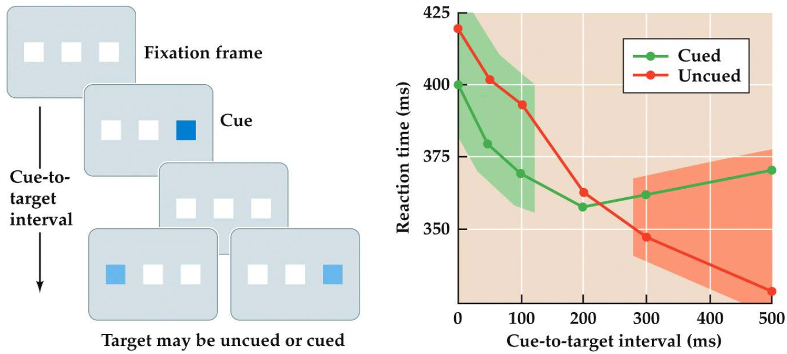 | **Method:** Subjects are presented with a sensory cue (e.g. a flash of light) at a particular location shortly before the target stimulus is presented in either that location or elsewhere. <br /><br />**Result:** Reaction time increases when presented with a valid cue shortly before the target stimulus (green area). When increasing the interval, however, the response time for validly cued targets<br /> decreases. This is due to something known as inhibition of return (after Klein, 2000). |


## Neuroscience Approach to Studying Attention

|                             |                                                              |
| --------------------------- | ------------------------------------------------------------ |
| 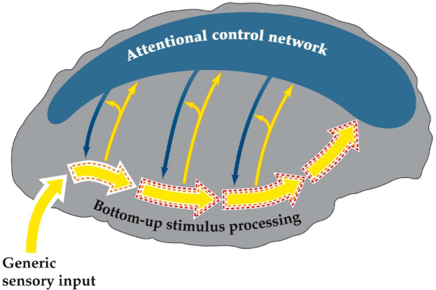 | Cognitive psychologists generally think attention works like the model to the left. When translating this model to a neuroscience framework, attention tends to be approached from two main perspectives:<br /><br />1.) Investigating how the neural processing of stimuli are regulated by attention.<br />2.) Determining the brain regions that coordinate these regulations (i.e. the higher-level control regulations), and the mechanisms these regions use. |

**What we know about perspective 1:** Attentional regulation should be reflected by changes in neural activity. For sensory systems, this would be in the thick yellow arrows in the right-hand figure. However, studies measuring behaviour performance (e.g. reaction time or accuracy) w.r.t. attention always depend on indirect approaches. Although, our ability to measure brain activity (while the subject is performing a task) has rapidly evolved in recent years. These developments can reveal much about neurobiological mechanisms of attentional effects on stimulus processing.

**What we know about perspective 2:** Studies have indicated that some higher-level brain areas are involved in attentional control. Particularly specific regions in the frontal and parietal lobes. This network seems to control attention with top-down neural signals (i.e. the descending blue arrows in the brain image) that regulate stimulus processing at multiple levels. These proposed mechanisms are explained in the following two subsections.


## Neural Effects of Auditory Attention on Stimulus Processing

The activity from 0 to 10ms comes from the brain stem. 10ms is not enough time for a stimulus to be processed in the neocortex. We want to know when attention effects the response to the stimulus (brain stem, early in the neocortex, late in the neocortex, etc.)

### Early and Late Auditory Selection

\<figure on slide 12\>

## Neural Effects of Visual Attention on Stimulus Processing

### Neuroimaging of Visual Spatial Attention

\<slide 17\>

### Effect of Visual Spatial Attention on ...


## Role of Neural Mechanism of Attention in Solving the Binding Problem

**binding problem:** to perceive an object, you need to be able to "bind" the properties of that object together.

We perceive objects via its features.

<font size="2" style="color:#777799">*can we come up with some experiements in which the visual system isn't able to correctly bind the features to the object?*</font>

| Illusory Conjunction Demonstration                           |                                                |
| ------------------------------------------------------------ | ---------------------------------------------- |
| **Method:** of 2 different tasks:<br />1.) answer some question about the outer 2 numbers (e.g. are they both odd?)<br />2.) after task 1, without looking back at the figure, recall what letters and bars were in the middle<br /><br />**Result:** participants reported seeing letters that weren't there, but that could be compositions of other letters that *were* present (e.g. P + Q = R) with a higher probability than chance<br /><br />**Conclusion: **Participants incorrectly bound features to objects. e.g. bound the diagonal line from a Q to a P to produce an R. This effect is called *Illusory Conjunction* | 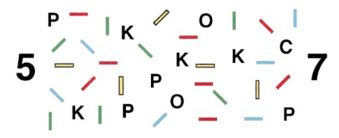 |

<font size="-1" style="color:#777799">*from this, researched assumed that there is some attention the visual system needs to use to keep these features bound to the right objects. This theory was later dropped*</font>


| Physiological Evidence for the Binding Problem               |                                                |
| ------------------------------------------------------------ | ---------------------------------------------- |
| different features (what, where) are processed in different regions in the visual system. The system must somehow integrate these features into a single object.<br /><br />The binding problem is only there if the neurons that relay feature information don't bind to a specific location <br />(e.g. neurons encoding red will fire if red is perceived, regardless of the location in the visual field).<br/>The visual field of the neurons along a pathway will gradually increase (think: convolutional neural network) | 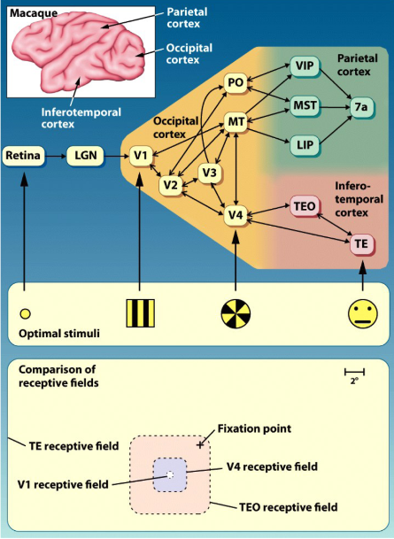 |


### Attention as a Possible Solution for the Binding Problem

| Attention and Shrinking Receptive Fields                     |                                                              |
| ------------------------------------------------------------ | ------------------------------------------------------------ |
| **Method:** monkey fixes on a point. 2 peripheral stimuli are presented simultaneously, one of which was cued. Responding to the cued stimulus will result in a reward (the cue's accuracy is 100%).Additionally, a probe is inserted into area V4, which records a certain group of neurons responsible for perceiving a certain feature (e.g. vertical lines).One stimulus contains this feature to a higher extent ("effective/preferred stimulus") than the other stimulus ("ineffective/poor").<br /><br />**Result:** monkey learns the connection between the cue and the target stimulus. The resulting graph is a histogram, where x=timestamp and y=firing rate. The graph shows that, when the monkey pays attention to a cued stimulus, the neurons fire as if the unattended stimulus basically isn't there.<br /><br />**Conclusion:** Attention provides a possible solution to the binding problem, by shrinking/focussing the receptive field. This affect of attention on the receptive field is done by higher level regions in the visual system, which provide feedback to V4 after receiving a cue. Depending on what the receptive field shrinks around, the features present in new field will be different. These features, together with the knowledge of what the attention is directed to, allow the brain to infer which features belong to what object. | 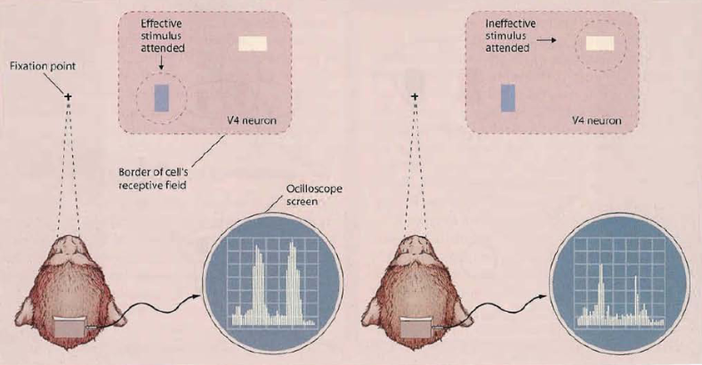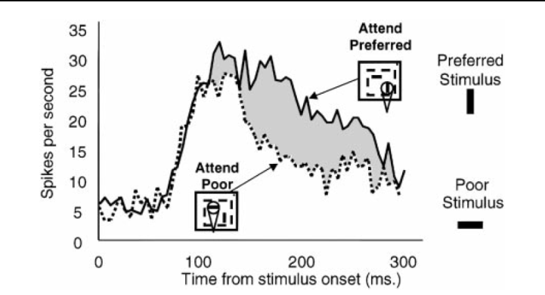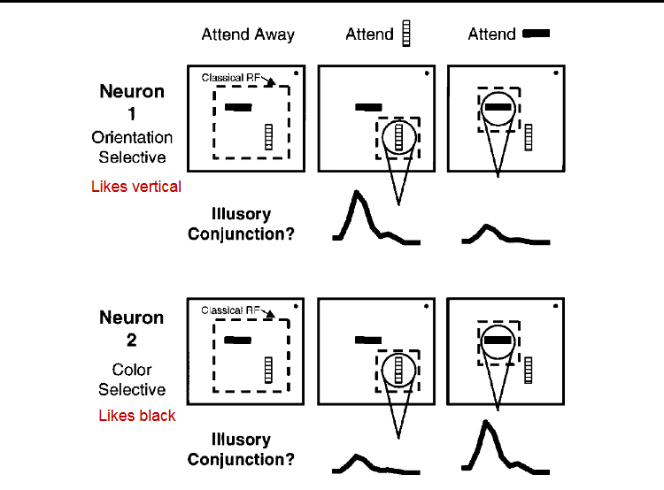 |

**Competition between neurons (Desimone & Duncan):** *Neurons compete with each other, depending on what features are present in the receptive field. If one group of neurons is firing strongly, the others fire less. i.e. **inhibition.** (lateral inhibition or general inhibition?)*

Inhibitory neurons are always local. Their signals don't travel very far.


**Hypothesis on the Role of Attention on Neural Competition:** Attention towards a particular location generates signals outside the visual cortex. These signals are then fed back into the visual cortex, where they bias the competition in favour of neurons that respond to that location. These neurons will then laterally inhibit the other neurons. (Location information is stored in the parietal cortex.)

| First Test of Biased Competition Hypothesis                  |                                                |
| ------------------------------------------------------------ | ---------------------------------------------- |
| **Method:** 2 stimuli: probe (neutral, static) and ref (will be attended to later, variable).<br />"att. away" means "without attending to a stimulus"<br /><br />4 conditions:<br />1.) only probe<br />2.) only ref<br />3.) both<br />4.) both but attending ref<br /><br />Graph 1: neuron likes ref<br />Graph 2: neuron dislikes ref<br /><br />**Result:** Attending ref gives the same result as only showing ref (as expected from previous experiments).<br />Showing both results gives an average between "only probe" and "only ref". <br /><br />**Conclusion:** This shows evidence for biased competition. Since when both stimuli are presented,<br />the activation of a neuron is equal to the average of its activation for each individual stimulus.<br />As seen in graph 2, attention can also decrease activation (compare condition 3 with 4) | 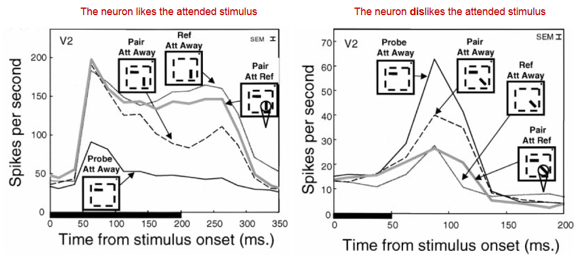 |

| Second Test of Biased Competition Hypothesis                 |                                                |
| ------------------------------------------------------------ | ---------------------------------------------- |
| **Method:** fMRI measurements. SEQ and SIM blocks. 2 conditions:<br />1.) no attention<br />2.) attend to a specific stimulus <br /><br />Each stimulus is within the receptive field of a specific V1 neuron (different neuron per stimulus).<br />fMRI machine measures signal over all of these neurons.<br /><br />**Result:** cond1: SIM resulted in lower activation in V4. <br />Cond2: attended SIM block has the same activation in V1 as a SEQ block<br /><br />**Conclusion:** cond1: lower activation in V4 for SIM blocks is due to competitive interactions.<br />Cond2: in attended SIM blocks, the activation of the neurons pertaining to the attended stimulus is biased.<br />This results in V4 being activated as if the attended stimulus is presented sequentially. | 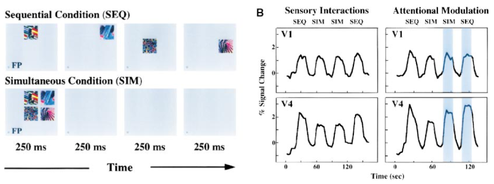 |

| Attentional Bias in the Absence of a Stimulus                |                                                |
| ------------------------------------------------------------ | ---------------------------------------------- |
| **Method:** fix on a point and show only a cue. Record the activity of neurons pertaining to location B. Cue was presented long before x=0. Measure long-lasting activation.<br /><br />**Result:** even long after the cue was presented, the activation is higher when the cue indicated location B, than location A.<br /><br />**Conclusion:** attention has a long lasting effect on the bias of neurons pertaining to the attended area. | 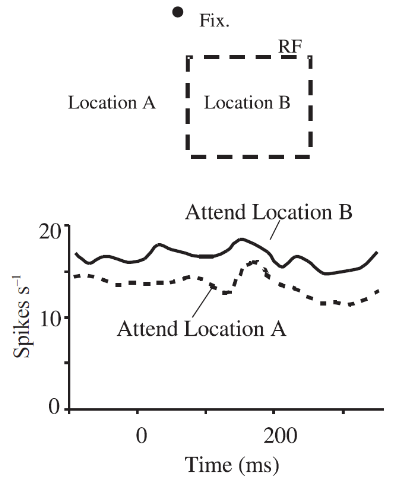 |

Some experiments didn't show effects of attention, even though it _was_ manipulated in the experiment. The hypothesis for this is that, in those experiments, the stimuli were too simple, so the visual system wasn't challenged enough to require attention.

| Effect of Task Difficulty on Neuronal Activity               |                                                |
| ------------------------------------------------------------ | ---------------------------------------------- |
| **Method:** 2 conditions:<br />1.) distinguish one bar from another bar whose difference in rotation is 90 degrees (easy).<br />2.) distinguish between two bars differing 22.5 degrees (difficult).<br /><br />**Result:** higher neuronal activity for the difficult task | 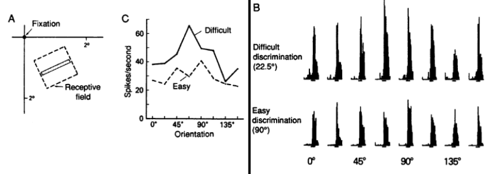 |


| Model for Neuronal Activity Depending on Attention and Perceivability |                                                |
| ------------------------------------------------------------ | ---------------------------------------------- |
| 3 dimensions:<br />- Normalised Response: activation of a particular neuron<br />- Relative Orientation: the extent to which the particular neuron pertains to the presented stimulus<br />- Log Contrast: logarithm of the ease at which the neuron can perceive the stimulus. <br />Low contrast means difficult to perceive, high means easy to perceive<br /><br />Important to note that there is a maximum activation of neurons<br /><br />When a stimulus has either very high or low contrast,<br />the difference in activation between the stimulus being attended and not attended is very low. | 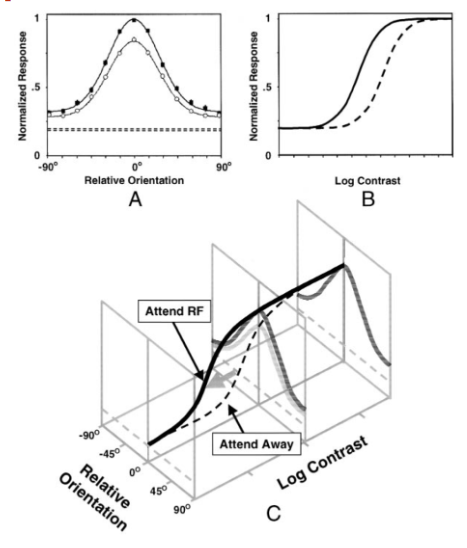 |

| Biased Competition in Nonspatial Attention                   |                                                |
| ------------------------------------------------------------ | ---------------------------------------------- |
| **Method:** record activity of neuron that pertains to a certain object (e.g. "flower"). <br />Cue either flower, mug or cherries in the middle of the screen. <br />Then show the flower and mug on the side of the screen. Small vertical bar shows the time of the fastest eye movement.<br /><br />**Result:** even before the monkey shifts its eyes, there is a difference in firing rate between attending the preferred and non-preferred stimulus.<br /><br />**Conclusion:** This indicates that the attention also affects the bias of neurons that don't pertain to a particular location (i.e. bias in covert spatial attention) | 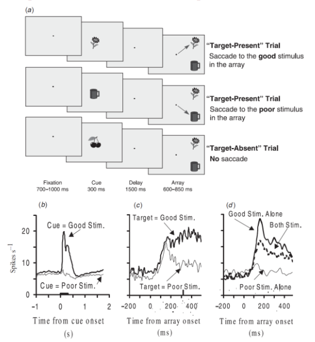 |


# 2. Cognitive Control by the Anterior Cingulate Cortex

# 3. Frontal Asymmetry of Motivational Control

# 4. Visual Stability

# 5. Motor Control

# 6. Neocortical Consolidation

# 7. Semantic Integration in Sentence Processing

